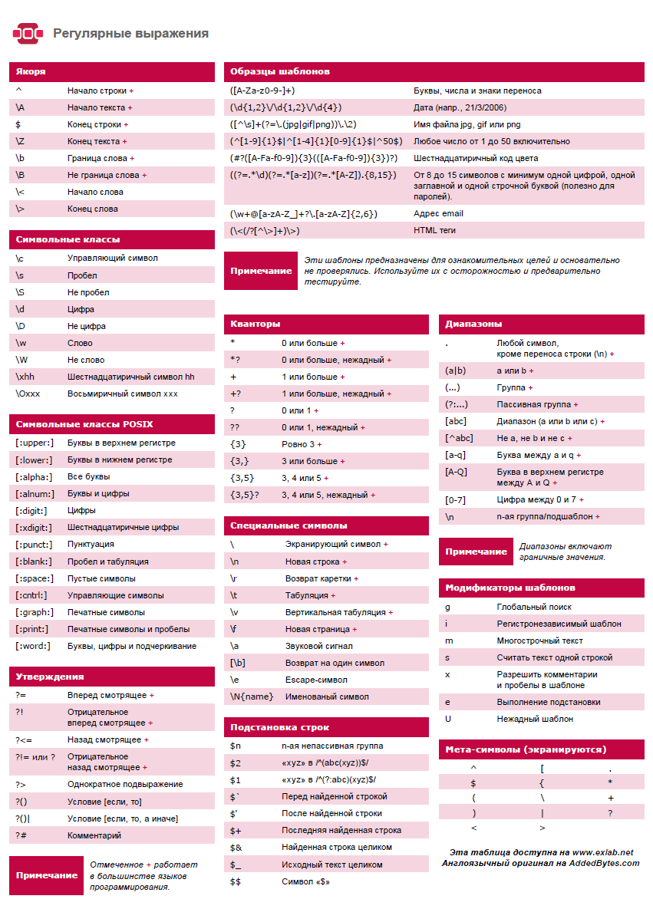

Регулярные выражения
====================

# Оглавление

1. <h3>[Теория](#Теория)</h3>

    - [Частичная замена (изменение текста)](#Частичная-замена-(изменение-текста))
    - [Шпаргалка](#Шпаргалка)

2. <h3>[Примеры](#Примеры)</h3>

    - [Поиск текста записанного через тире](#Поиск-текста-записанного-через-тире)
    - [Валидация email](#Валидация-email)
    - [Удаление повторяющихся слов](#Удаление-повторяющихся-слов)


<a name='Теория'></a>
## Теория

<a name='Частичная-замена-(изменение-текста)'></a>
### Частичная замена (изменение текста)

Иногда бывают ситуации, когда необходимо найти при помощи регулярного выражения
кусок текста и например поменять в нем слова местами или заменить только часть
найденного текста.

Данную задачу можно решить обращаясь к группам регулярных выражений (части 
регулярного выражения заключенные в круглые скобки).
 
К группам можно обращаться 2 способами:

1. через символ доллара $0 - $9 (работает в IDEA)
2. через обратный слеш \0 - \9 (работает в python)

**Обращение через $ (IDEA)**

Важно заметить, что данный синтасис поддержиается не всеми текстовыми 
редакторами и языками.
Вот простой пример показывающий как добавить слово в найденное предложение.

Исходный текст:

```
как тебя зовут друг
```

Регулярное выражения для поиска текста:

```regexp
(.*зовут)\s+(друг)
```

Регулярное выражения для замены:

```regexp
$1 дорогой $2
```

В результате замены получим:

```regexp
как тебя зовут дорогой друг
```


**Обращение через косую черту (python)**

```python
>>> import re
>>> data = 'Вася пупкин дурак красавчик'
>>> pattern = '(.*) (дурак) (.*)'
>>> a = re.sub(pattern, r'\1 не \2 \3', data)
>>> a
'Вася пупкин не дурак красавчик'
```


<a name='Шпаргалка'></a>
### Шпаргалка

Шпаргалка по синтаксису regexp



<a name='Примеры'></a>
## Примеры

<a name='Поиск-текста-записанного-через-тире'></a>
### Поиск текста записанного через тире

Условия регулярного выражения:
 - текст должен начинаться с большой буквы
 - тире может быть только 1 или его не будет сосвсем
 - текст должен быть длинной минимум 3 символа, максимум 15

Пример текста: 

```
Test-test
```

Решение: 

```regexp
^(?=.{3,15}$)[A-Z][a-z]+-?[a-z]+$
```

<a name='Валидация-email'></a>
### Валидация email

Если возникла идея валидировать email при помощи регулярного выражения, то
самый лучший способ это сделать, это проверить, что в строке пристуствует 
символ @. Все остальные варианты будут слишком сложными и все равно не будут 
покрывать всех возможных вариантов.

Решение:

```regexp
.+@.+
```

Материалы по данной теме:

- [Прекратите проверять Email с помощью регулярных выражений!](https://habr.com/post/175375/)


<a name='Удаление-повторяющихся-слов'></a>
### Удаление повторяющихся слов

Удаляет повторяющиеся слова:

```python
>>> import re
>>> data = 'Вася Вася пупкин Вася дурак Вася красавчик'
>>> pattern = r'(\b\w+\b\s)(?=.?\1)'
>>> a = re.sub(pattern, '', data)
>>> a
'Вася пупкин Вася дурак Вася красавчик'
```

Удаляет повторяющиеся слова, даже те, что не идут подряд.

Вариант для киррилицы:

```python
>>> import re
>>> data = 'Вася Вася пупкин Вася дурак Вася красавчик'
>>> pattern = r'(\b[а-яА-яёЁ]+\b\s)(?=.*?\1)'
>>> a = re.sub(pattern, '', data)
>>> a
пупкин дурак Вася красавчик
```

Вариант для латиницы:

```regexp
(\b\w+\b\s)(?=.*?\1)
```

[Ссылка](https://zharikov.site/note/regexp_delete_repeatwords.html) на 
оригинальную статью.